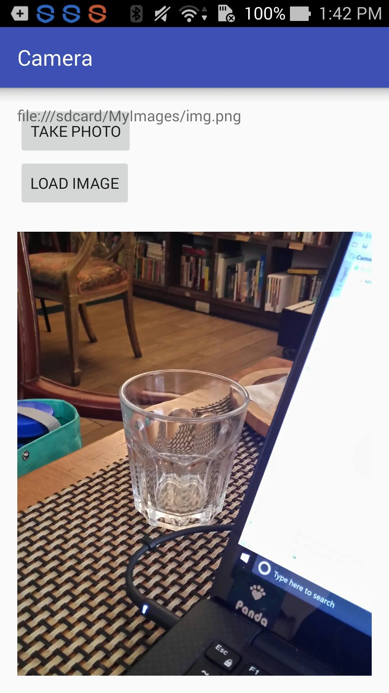
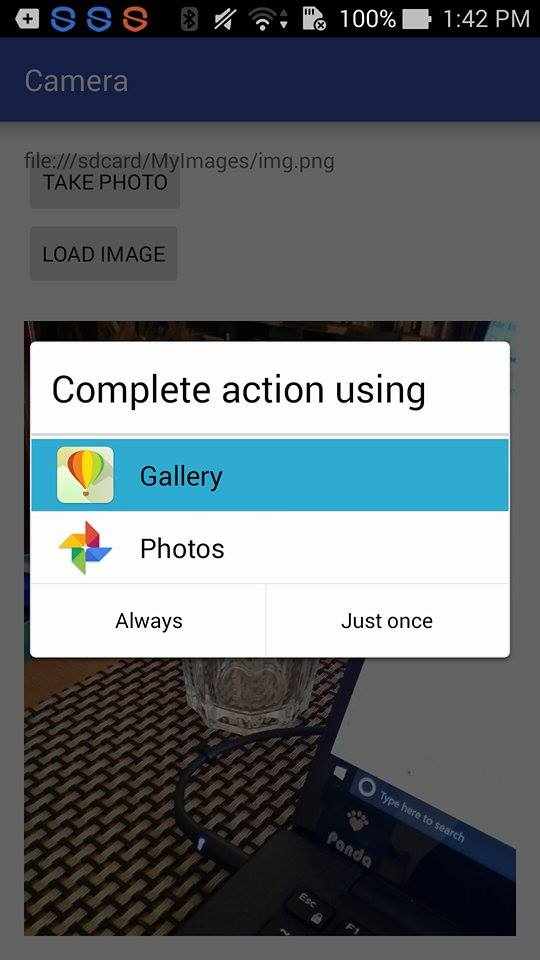

Use camera and access photo library with Android Studio

### Add the Following Line in Android Manifest.xml
\<uses-permission android:name="android.permission.MANAGE_DOCUMENTS" />\
\<uses-permission android:name="android.permission.READ_EXTERNAL_STORAGE" />\
\<uses-permission android:name="android.permission.WRITE_EXTERNAL_STORAGE" />

### Result
Use camera and show the captured image
The image is named "img.png" and saved in a new folder in internal storage: file:///sdcard/MyImages/img.png

Access photo library

Show picked image from photo library

/***note: working on getting the content uri of camera image file***/
