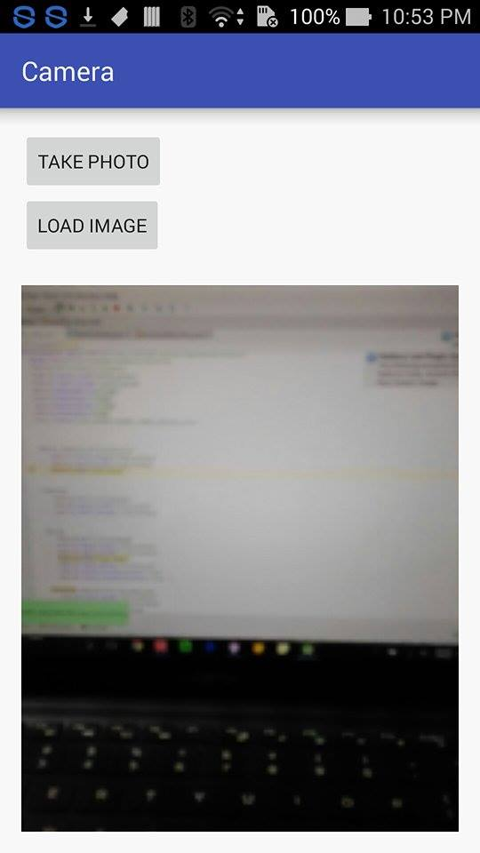

Use camera and access photo library with Android Studio

### Add the Following Line in Android Manifest.xml
\<uses-permission android:name="android.permission.MANAGE_DOCUMENTS" />\
\<uses-permission android:name="android.permission.READ_EXTERNAL_STORAGE" />

### Result
Use camera and show the captured image

/***note that this program can access photo library but so far unable to show the picked image***/
